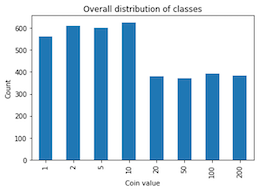

# Coin Counter 2 Gether

> Please note that the code and contributions in this GitHub repository were created through a collaborative effort by [@Irish-77](https://github.com/Irish-77) and [@Ronho](https://github.com/Ronho). Both contributors acknowledge that their work is of equal merit and that they each have a deep understanding of the other's contributions.

Coin Counter 2 Gether is a mobile app that simplifies the counting of coins with the help of artificial intelligence. For this purpose, existing pictures can be selected in the app or a new picture can be taken. The area being viewed is displayed so that one can be sure that all coins are being observed. After the coins have been detected, the coins found are visualised with their value within the app and immediately added up. Coin Counter 2 Gether is your coin counting helper so you can always get the most out of your money and take your investments to the next level!

## Table of contents
1. [Installation](#installation)
    - [Server](#server)
    - [Client](#client)
1. [Description](#description)
    - [Client](#client)
    - [Machine Learning](#machine-learning)
    - [Deployment](#deployment)


## Installation
The installation requires several steps and assumes at certain points that other software components are already installed.

First, clone this project.

```sh
git clone https://github.com/C2G-BR/Coin-Counter-2-Gether.git
```

### Server

For the server side of the application, [Python](https://www.python.org/) is required. The setup was tested with Python 3.10 tested. Inside the [server](server/) folder, execute the following command to install all required packages
```sh
pip install -r requirements.txt
```

#### API

To start the API, [server.py](server/server.py) must be started using
```sh
python server.py
```
The output will be similar to
```sh
Finished initializing CoinDetector
 * Debugger is active!
 * Debugger PIN: 989-671-331
 * Running on http://127.0.0.1:5000/ (Press CTRL+C to quit)
```
Opening `http://127.0.0.1:5000/` shows the swagger documentation of the api.

#### ngrok (optional)

Caution this step should only be performed if the risks are known and can be assessed.

The goal of this step is to make a locally launched instance of the API publicly available to enable the separation of the server from the client in real terms. To do this, first create an account at [ngrok](https://ngrok.com/). This is a provider that creates a tunnel between a public IP address and your locally running instance of the API. After creating the account, you need to create an authtoken via ngrok. Use the [documentation of ngrok](https://ngrok.com/docs/getting-started/) for this. Now, it is assumed that the API is started locally. After that, the authtoken and port must be adjusted within the [ngrok.py](server/ngrok.py) (lines 5 and 6). By default, port 5000 is used, but watch the output in your terminal from the API. Then start ngrok with the command below inside [server](server/).
```sh
python ngrok.py
```
You should now be shown a link to your publicly available API. For possible errors watch the output of the terminal. Sometimes you have to do additional steps to activate your ngrok account. Use the link in the frontend from another system as described below.

### Client
The frontend can either be downloaded from the Google Play Store or installed by Flutter. Both ways are described below. However, running the frontend requires that the API is already running locally in either case, otherwise some features will not be available.

#### Option 1: Play Store
You can download the app from Google Play Store [here](https://play.google.com/store/apps/details?id=com.c2g.frontend).

#### Option 2: Flutter Installation
It is required that [Flutter](https://docs.flutter.dev/get-started/install) is installed. The project has been tested with Flutter version 3.7.0. Once flutter is installed run
```sh
flutter pub get
```
inside of [client](client/) or use your IDE to download all dependencies. Afterwards you can build the app and install it on your device or use an emulator to test the app. For further information about this, please refer to the offical Flutter [documentation](https://docs.flutter.dev/).

#### Connection to API
As the frontend is mostly used for testing purposes, it is required to enter the url to the API endpoint.
Frontend Home                      | Frontend Home with API Url (Local Setup)
:---------------------------------:|:---------------------------------:
 | 


This should be part of the server's output. However, note that if the server is run locally without ngrok, the client must also be on the same computer, otherwise the API will not be reached.

## Description

For the implementation of this application the following technology stack has been used:


### Client
The frontend is the interface between the users of Coin Counter 2 Gether and the server including the model. Since this is a test environment and the connection to the server is not given by a static IP, this can be set up on the home page (see [Connection to API](#connection-to-api)).

The application itself offers three main functionalities, which can be accessed via the icons without text at the bottom of the home page. On the one hand, images can be captured directly via the camera (icon on the left), but on the other hand, they can also be selected from the existing library. The process for capturing images and selecting them from the library is essentially the same. As an example, the steps up to the annotated image for capturing an image are listed below:

Step 1 | Step 2 | Step 3
:---:|:---:|:---:
 |  | 

Step 4 | Step 5 | Step 6
:---:|:---:|:---:
 |  | 

1. Open the application.
1. Enter the server URL and select the photo icon.
1. Take a picture of coins.
1. If you are not satisfied with the picture, you can take another one.
1. Since the image must have a square shape, the area can be selected and scaling and rotation can be applied.
1. Once the server has processed the image, it will be displayed with comments about the detected coins and general metrics such as the total number and value of detected coins. The annotations consist of two parts. The first (before the at-symbol) represents the value of the coin in cents and the second (after the at-symbol) the confidence of the model. In addition, the server saves a copy of the image with server-side annotations.

The download icon (icon on the right) allows you to download the edited image so that you can save it.

### Machine Learning

#### Data
The data has proved to be a considerable difficulty. Since, even for us humans, it is difficult to tell the difference between 1- and 2-cent coins, we required a wide range of data - especially data that can be used for object detection.
During our research, we came across the [euro-coin-dataset](https://github.com/SuperDiodo/euro-coin-dataset), which consisted of images including their labels in Pascal VOC format. Additionally, we took our own photos and labeled them by hand in the same format using the tool [LabelImg](https://github.com/heartexlabs/labelImg) (which was btw a real pain in the ass xD).


Our dataset can be found on [Kaggle](https://www.kaggle.com/datasets/bastianberle/eurocoins-images-object-detection).

Data | Distribution
:---:|:---:
Images per Folder |  
Classes Distribution | 
Training Data | 
Number of Objects per Image | 

Overall, it can be observed that the distribution is balanced, with 10-cent being comparatively the most common. However, the general distribution also shows that 20- and 50-cent as well as 1- and 2-euro coins are comparatively less common.
Since most of the images have a squared resolution of 3024x3024 pixels, all images were scaled to a square format during the training.

Before the data can be used for training, it must first be divided into training and test data. The goal was to distribute the classes in the training data equally in order to avoid any bias. Accordingly, when splitting the images, attention was paid to ensuring that the distributions were similar, i.e. it was decided individually for each class or folder how the data should be split. Nevertheless, it was not possible to achieve a 100% match.

#### Model
The original concept was to host the model on the clients device, which is why we chose to train a model with a pre-trained MobileNetv3 backbone. In the course of implementing the project, we changed our mind and hosted the model on the backend. As a header, we use a Faster R-CNN. The model was implemented using PyTorch.

**Training & Evaluation**
* Due to the effort involved in capturing and labeling of the images, we decided to use data augmentation. We changed the following properties of the image randomly: contrast, brightness, saturation, blur, grayscale, horizontal flip, vertical flip. An example looks like this:

    

* The model was trained for 287 epochs with a batch size of 4. The backbone was pre-trained on the COCO dataset.

    

* The model achieved an average precision of 0.79 on the test data.

* In the precision-recall curves, it is noticeable that the curve for the 2- and 20-cent coins performs particularly poorly compared to the rest.
    
    

**Model Parameters**
Parameter | Description
:---:|:---:
Target Image Resolution | 1000x1000
Momentum | 0.9
Learning Rate | 0.0005
Weight Decay | 0.0005
Optimizier | Stochastic gradient descent


#### Notebook Overview
Each step from data analysis to model evaluation was performed in a notebook instance on Google Colab.

Step | Description | Notebook
:---:|:---:|:---:
01 | Consolidate different data sources and generate an annotation file that contains the information for all images | [Data Collection](model-training/01_data_collection.ipynb)
02 | Explore data in terms of size, distribution, and quantity | [Data Exploration](model-training/02_data_exploration.ipynb)
03 | Objects analyzed for size and divided into three clusters | [Data Object Size Analysis](model-training/03_data_object_size_analysis.ipynb)
04 | Partitioning data into train and test splits | [Data Preparation](model-training/04_data_preparation.ipynb)
05 | The model was trained on an Nvidia Tesla P100 | [Hardware Check](model-training/05_hardware_check.ipynb)
06 | Training a Faster R-CNN with a pre-trained MobileNetv3 Backbone | [Training](model-training/06_model_training_mobilenet.ipynb)
07 | Evaluating the model training | [Training Analysis](model-training/07_model_training_analysis.ipynb)
08 | Test the model on test split and conduct COCO benchmark | [Model Testing](model-training/08_model_testing.ipynb)
09 | Development and testing of the backend logic for the model incl. its data pipeline | [Model Deployment](model-training/09_model_class_for_deployment.ipynb)

### Deployment
The backend, which is the API, uses Flask. The API was developed largely following the REST principle and provides an endpoint that can be reached via the root endpoint. Calling the API via the browser, leads the user to a Swagger documentation of the API, which allows testing of the endpoints.
For processing, two main classes have been implemented to handle this. The "Pipeline" class converts the image into a tensor as required by PyTorch and scales the image to an appropriate format.
The "CoinDetector" class loads the corresponding model and initializes a pipeline instance. At first, the image is passed through the described pipeline and then passed to the model for predictions. 
In addition, the model class has a threshold value that determines with what confidence detected objects are considered. In order to display the bounding boxes in the frontend, the absolute coordinates are converted into percentage coordinates. These values and the total sum in Euros are sent back to the client.


## Further Reading Material
(Usage only recommended with humor!)
- [🇬🇧 Presentation of the project](docs/cc2g_presentation_english.pdf)
- [🇩🇪 Presentation of the project](docs/cc2g_presentation_german.pdf)

[Go back to table of contents](#table-of-contents)